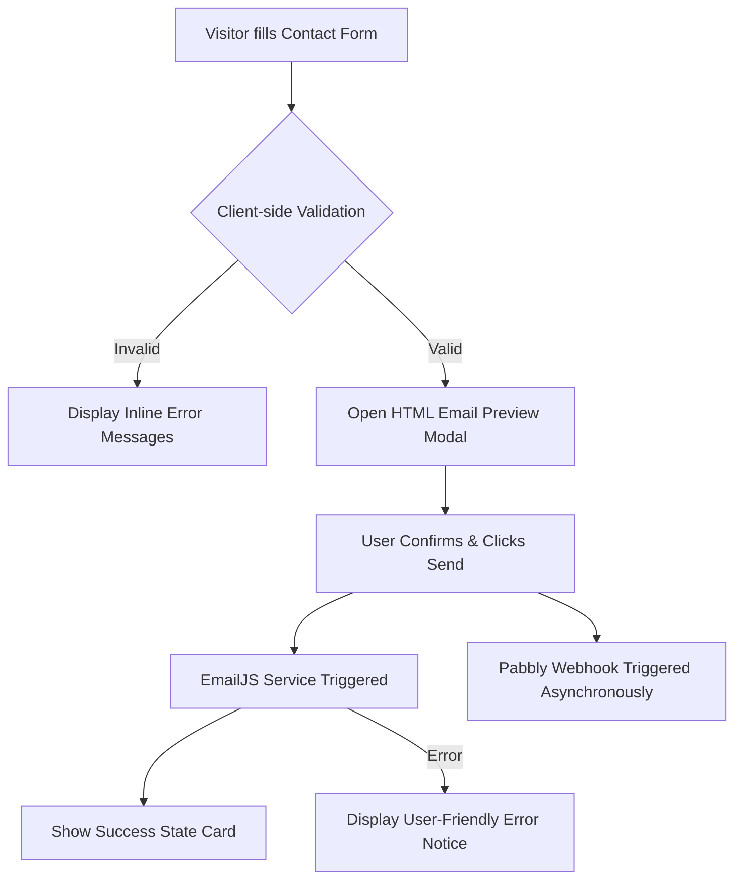

# 🌟 Manikandaprabhu G — Developer Portfolio

<div align="center">

  

  <h3>🚀 Modern, High-Performance Personal Portfolio & Showcase</h3>

  <p>
    A sleek, ultra-responsive dark-mode portfolio built with vanilla web technologies, featuring rich glassmorphism aesthetics, dynamic micro-interactions, schema-rich SEO, and a multi-stage automated contact dispatch system.
  </p>

  <p>
    <a href="https://github.com/ManiprabhuG/gmani_Portfolio"></a>
    <a href="https://github.com/ManiprabhuG/gmani_Portfolio"></a>
    <a href="https://github.com/ManiprabhuG/gmani_Portfolio"></a>
    <a href="https://github.com/ManiprabhuG/gmani_Portfolio"></a>
  </p>

  <p>
    <a href="#-about-the-portfolio">About</a> •
    <a href="#-key-features">Key Features</a> •
    <a href="#-technology-stack">Tech Stack</a> •
    <a href="#-project-structure">Project Structure</a> •
    <a href="#-contact-system-architecture">Contact Workflow</a> •
    <a href="#-projects-showcased">Projects</a> •
    <a href="#-getting-started">Getting Started</a> •
    <a href="#-author--connect">Connect</a>
  </p>
</div>

---

## 👨‍💻 About The Portfolio

This repository hosts the official personal developer portfolio for **Manikandaprabhu G**, a **Front-end Developer & SEO Specialist** based in Tamil Nadu, India. 

Designed with a high-end, cyberpunk-inspired dark aesthetic (`#050507` canvas with `#FF2D78` neon accents), the site is engineered without hefty frameworks to achieve lightning-fast load times, flawless 60fps animations, mobile-first responsiveness, and search engine discoverability.

---

## ✨ Key Features

### 🎨 Visual & UI/UX Excellence
- **Custom Dark Neo-Glassmorphism:** Curated color palette combining deep obsidian blacks, translucent glass cards, and radiant hot-pink glow accents.
- **Dynamic Cursor Glow Follower:** Interactive radial cursor illumination (`#cg`) tracking mouse movements across desktop viewports.
- **Ambient Pulsing Orbs:** CSS-animated background radial light sources creating depth and visual hierarchy.
- **Subtle SVG Noise Overlay:** Fine fractal noise filter mapped across the viewport for a tactile, matte texture.
- **Scroll-Triggered Stagger Animations:** Built with modern `IntersectionObserver` API for smooth, performance-friendly staggered card reveals.
- **Dynamic Active Navigation:** Automatically tracks current viewport section and updates navigation states dynamically.
- **Mobile-First Responsive Drawer:** Custom-crafted hamburger drawer for tablets and mobile devices with fluid transition states.

### 📬 Automated Contact Pipeline
- **Interactive Form Validation:** Real-time sanitization and client-side validation for mandatory fields.
- **Live HTML Email Preview Modal:** Gives the user a styled preview of their message formatted into a card before sending.
- **Dual Dispatch Integration:**
  - **EmailJS:** Direct client-side email transmission to inbox.
  - **Pabbly Webhook Listener:** Asynchronous webhook trigger for automated backend workflows and CRM syncing.
- **Dedicated Success Card:** Clean state transition replacing the form upon successful transmission without requiring page reloads.

### 🔍 Comprehensive SEO & Performance
- **Semantic HTML5:** Built strictly adhering to semantic structure (`<header>`, `<nav>`, `<main>`, `<section>`, `<article>`, `<footer>`).
- **Structured Schema.org JSON-LD:** Implements rich `Person` schema markup for enhanced search engine knowledge panels.
- **Open Graph & Twitter Cards:** Comprehensive metadata for social sharing and link previews.
- **Standalone 404 Page:** Custom animated error page with floating SVG blobs and return-to-home navigation.

### ⏱️ Time Travel Engine (`time_travel.js` / `style.js`)
- Includes standalone timeline computation utilities that convert age into exact days, hours, minutes, and seconds, with recursive English word translation and educational milestone breakdowns.

---

## 🛠️ Technology Stack

| Layer | Technologies / Tools Used |
| :--- | :--- |
| **Core Frontend** | HTML5 (Semantic), CSS3 (Modern Flexbox & Grid), Vanilla JavaScript (ES6+) |
| **Typography** | Google Fonts ([Syne](https://fonts.google.com/specimen/Syne) for Display Headings, [DM Sans](https://fonts.google.com/specimen/DM+Sans) for Body) |
| **Styling Architecture** | Custom CSS Variables, Glassmorphism, Micro-animations, CSS Keyframes |
| **Email & Webhooks** | [EmailJS SDK v4](https://www.emailjs.com/), Pabbly Connect Webhook Integration |
| **SEO & Meta** | JSON-LD Structured Data, Open Graph Protocol, Twitter Meta Tags |
| **UI Design & Assets** | Canva, Affinity Designer, Vector Favicons (SVG) |

---

## 📂 Project Structure

```bash
Portfolio/
├── images/
│   └── favicon.svg         # Brand SVG vector icon
├── index.html              # Main single-page portfolio application
├── style.css               # Core styling, responsive design tokens & animations
├── style.js                # Time calculation algorithm & timeline simulation
├── time_travel.js          # Interactive CLI Time Travel script (Node.js readline)
├── 404.html                # Custom animated 404 Not Found error page
├── Mani CV.pdf             # Downloadable professional curriculum vitae
└── README.md               # Project documentation and developer guide
```

---

## 🔄 Contact System Architecture



---

## 💼 Projects Showcased

1. **Magdeburg Indians** — Recreated and developed a responsive community portal with mobile-first architecture, UI enhancement, and fast asset delivery.
2. **RL Solution** — Contributed to UI design, resolved layout and responsiveness bugs, and optimized on-page SEO meta structures.
3. **Web Template Library** — Academic and internship repository of reusable, accessible, and cross-browser compatible templates.

---

## 🚀 Getting Started

### 1. Clone the Repository
```bash
git clone https://github.com/ManiprabhuG/gmani_Portfolio.git
cd gmani_Portfolio
```

### 2. Run Locally
Since this is a vanilla web application, no dependency installations (`npm install`) are required! You can open the project directly:

- **Option A (Direct in Browser):** Double-click `index.html` to open in any web browser.
- **Option B (VS Code Live Server):** Right-click `index.html` and select **"Open with Live Server"**.
- **Option C (Local Python Server):**
  ```bash
  python -m http.server 3000
  ```
  Visit `http://localhost:3000` in your browser.

### 3. Running the Time Travel Engine CLI
To run the terminal-based timeline simulation tool:
```bash
node time_travel.js
```

---

## 🌐 Deployment

This portfolio is static-ready and can be deployed instantly to:
- **GitHub Pages:** Go to *Settings > Pages > Branch: main > Save*.
- **Vercel / Netlify:** Import the repository directly without any build configuration commands.

---

## 📬 Author & Connect

**Manikandaprabhu G**  
*Front-end Developer & SEO Specialist*

- 📧 **Email:** [gmaniprabhu5@gmail.com](mailto:gmaniprabhu5@gmail.com)
- 💼 **LinkedIn:** [linkedin.com/in/maniprabhug](https://www.linkedin.com/in/maniprabhug)
- 📱 **Phone:** +91 82480 21895
- 📍 **Location:** Tamil Nadu, India

---

<div align="center">
  <sub>Crafted with passion, precision, and pure code. © 2025 Manikandaprabhu G.</sub>
</div>
